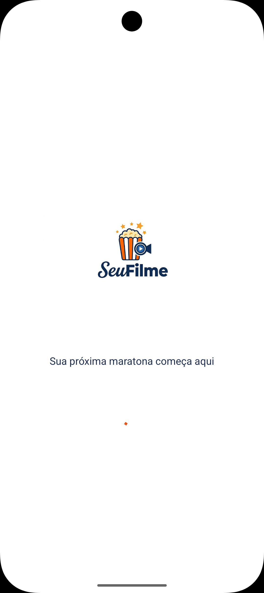
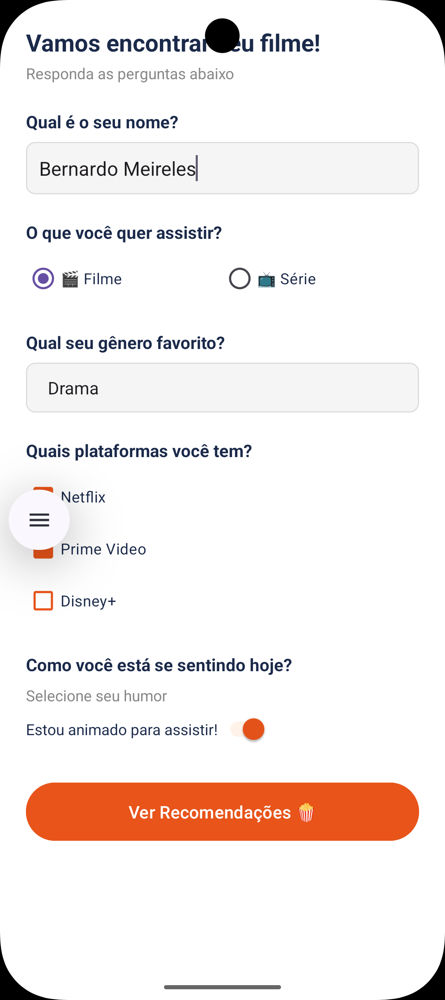
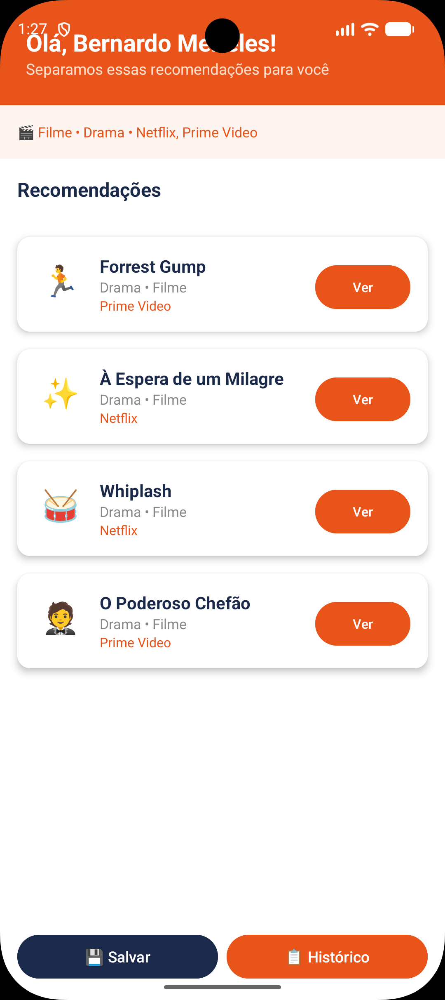
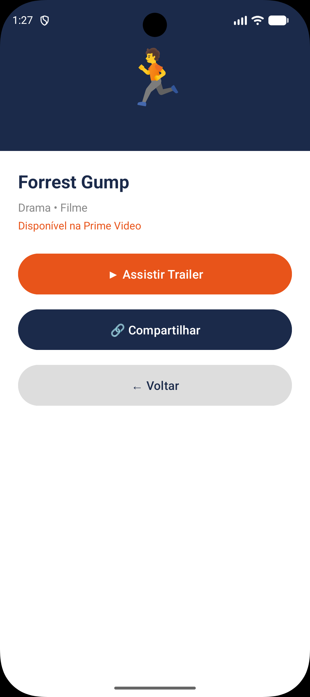
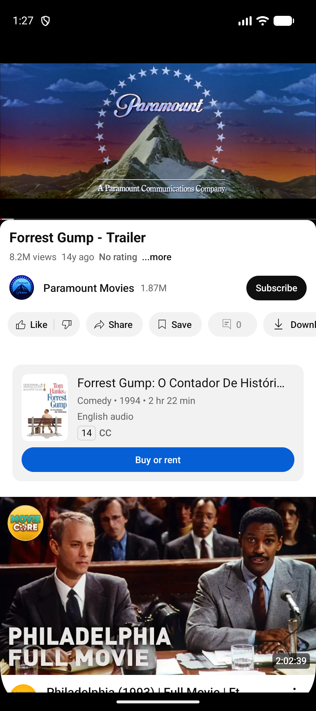
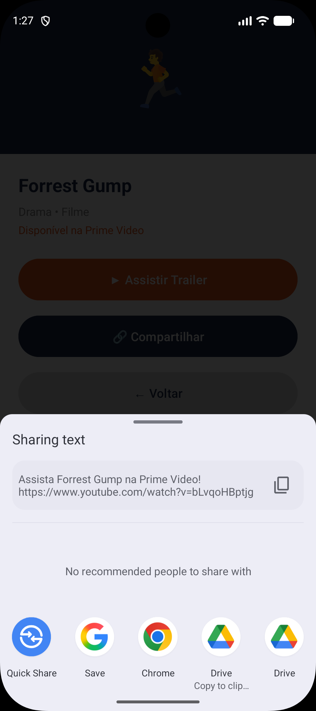
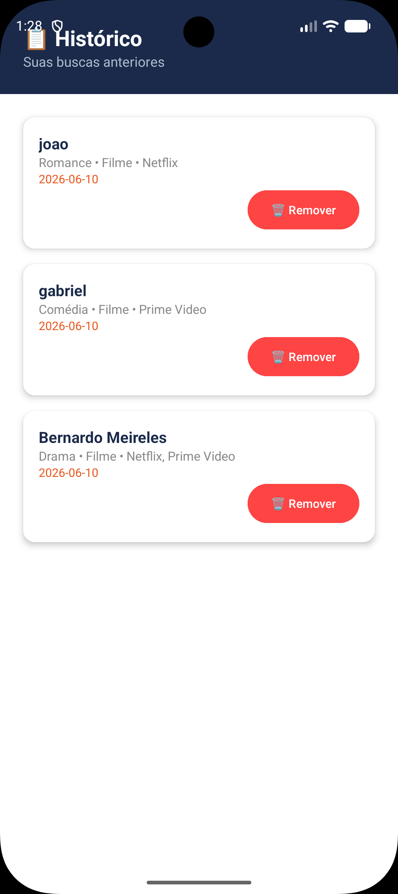
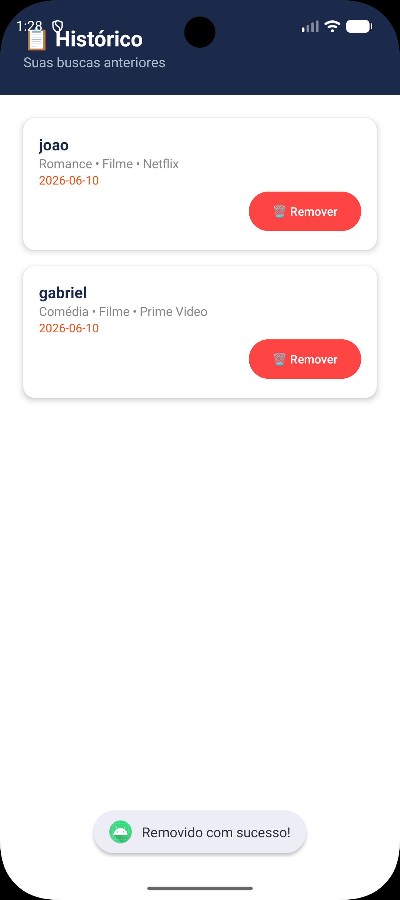

# 🎬 SeuFilme

## Descrição
Aplicativo Android de recomendação de filmes e séries. O usuário responde um formulário com suas preferências (gênero, plataforma, humor e tipo de conteúdo) e recebe recomendações personalizadas. Todas as respostas são salvas em um banco de dados relacional via API REST.

## Tecnologias Utilizadas

### Android
- Kotlin
- Retrofit 2 (integração com API REST)
- RecyclerView + CardView
- Fragments

### Backend
- Python + FastAPI
- SQLite (banco de dados relacional)
- SQLAlchemy (ORM)
- Swagger/OpenAPI (documentação automática)

## Telas do Aplicativo
| Tela | Tipo | Descrição |
|------|------|-----------|
| Splash | Activity | Tela de abertura com logo e loading |
| Formulário | Activity | Perguntas sobre preferências do usuário |
| Resultados | Activity | Lista de filmes/séries recomendados |
| Histórico | Activity + Fragment | Histórico de buscas salvas na API |
| Detalhe | Activity | Detalhes do filme com trailer e compartilhamento |

## Componentes Gráficos Utilizados
- TextView
- EditText
- Button
- ImageView
- CheckBox
- RadioButton
- Spinner
- Switch
- RecyclerView
- CardView
- ProgressBar

## Intents
- **Explícitas:** navegação entre todas as telas
- **Implícitas:** abertura de trailer no YouTube e compartilhamento via WhatsApp/outros apps

## API REST

### Endpoints
| Método | Rota | Descrição |
|--------|------|-----------|
| POST | /respostas | Salva as preferências do usuário |
| GET | /historico | Lista todas as respostas salvas |
| GET | /historico/{id} | Busca uma resposta pelo ID |
| DELETE | /historico/{id} | Remove uma resposta do histórico |

### Swagger
Acesse a documentação em: `http://127.0.0.1:8000/docs`

## Executar

### Backend (API)
```bash
cd seufilme-api
pip install -r requirements.txt
python -m uvicorn main:app --reload
```

### Android
1. Abra o projeto no Android Studio
2. Execute o app no emulador

### Fotos do Aplicativo

## Screenshots










## Aluno
Desenvolvido por **Bernardo Meireles** — AP2 Desenvolvimento Mobile 2026.1
